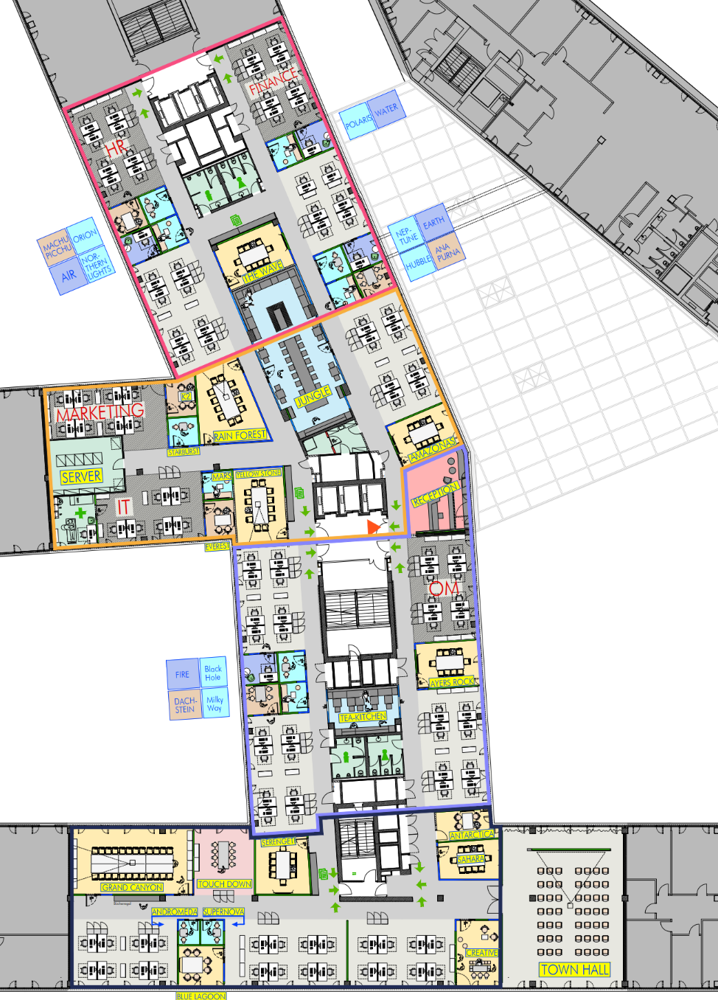

# Global Day of Coderetreat

*Welcome to a day of deliberate practice and learning!*

---

## Which Language? 💬

Spricht jemand nur Deutsch? Bitte melden.

Does anyone speak only English? Please report.

---

## Big Thank you to Nagarro! 💗

Thank you very much for hosting us!

---

## Your Event Guide

  

    <ul>
      <li>Wi-Fi Access</li>
      <li>Emergency Exits</li>
      <li>Smoking</li>
      <li>Checkin/Checkout</li>
    </ul>
  

  

    
    

    

      <strong>You Are Here</strong>
    

    

      <strong>Reception</strong>
    

    

      <strong>Kitchen</strong>
    

    

      <strong>Exit 1</strong>
    

    

      <strong>Exit 2</strong>
    

    

      <strong>Exit 3</strong>
    

  

---

## Dinner 🍽️

Who wants to join dinner?

*Please raise your hand.*

---

## Is this your first Coderetreat? 🥇

*Please raise your hand.*

---

## What is a Coderetreat? 🤔

> A day of deliberate practice and learning.

---

### Deliberate Practice and Learning?

- Not about getting things done
- Doing things differently
- Try out new ideas
- Do it right!

---

### How does it work?

- We work on the same problem repeatedly.
- Try out different approaches.
- Learn from each other.

Practice - reflect - improve! 🥳

---

## Schedule 🕤

| Time  | Topic  |
|-------|--------|
| 08:15 | Arrival & Breakfast |
| 09:00 | Welcome at Nagarro |
| 09:10 | Intro Coderetreat 👈 |
| 09:30 | Session 1 |
| 10:50 | Session 2 | 
| 12:00 | Lunch Break |
| 13:00 | Warmup |
| 13:10 | Session 3  |
| 14:40 | Session 4 |
| 15:55 | Session 5 |
| 17:00 | Final Retrospective
| 17:30 | Closing |

---

## About us 👋

*Facilitators in order of appearance.*

* Claus Aichinger [@clausaichinger](https://twitter.com/ClausAichinger)  
* Peter Kofler
* Gregor Riegler [@gregor_riegler](https://twitter.com/gregor_riegler)  
* Adam Zielinski [@adam0x5A](https://twitter.com/adam0x5A)  
* Roland Germ [@rolgerm](https://twitter.com/rolgerm)  

---

## What about you? 💐

Let's get to know each other:

* Who are you?
* Why is it better to be here than elsewhere?
* What will you contribute?

Form groups of three (with people you don't know).

---

## Code of Conduct 🤝

This code of conduct outlines our expectations for participants within our community:

* Be friendly and patient. Be welcoming.
* Be mindful of your peers.
* Be respectful.
* Be careful in the words that we choose.

---

## Questions?