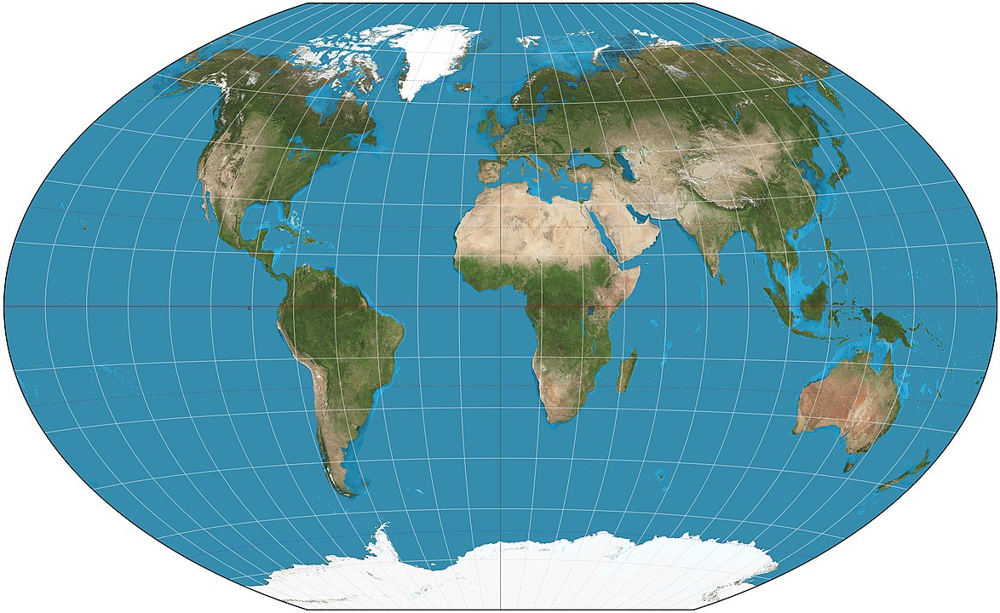
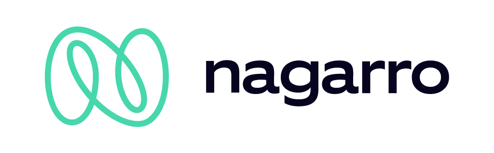

## Global Day of Coderetreat 2024

*Welcome to a day of deliberate practice and learning!*

  

---

## Which (Spoken) Language? 💬

Spricht jemand nur Deutsch? Bitte melden.

Does anyone speak only English? Please report.

---

## Big Thank You to Nagarro! 💗

---

## Your Event Guide

  

    <ul>
      <li>Wi-Fi Access</li>
      <li>Emergency Exits</li>
      <li>Smoking</li>
      <li>Checkin/Checkout</li>
    </ul>
  

  

    
    

    

      <strong>You Are Here</strong>
    

    

      <strong>Reception</strong>
    

    

      <strong>Kitchen</strong>
    

    

      <strong>Exit 1</strong>
    

    

      <strong>Exit 2</strong>
    

    

      <strong>Exit 3</strong>
    

  

