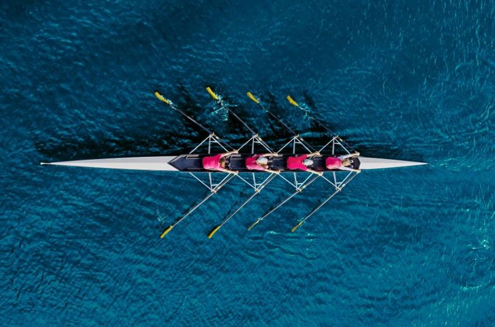

# Let's Connect

Focus: Let's get to know each other

Facilitator: Roland Germ [@rolgerm](https://x.com/rolgerm)

---

## Line Up by IT Experience

  

Form a line based on your IT experience

---

## Divide into Quadrants

  

Spread by the number of programming languages you know well or you have programmed in

---

## Prepare for the following Questions

- Who am I? (Wer bin ich …)
- What do I want to take away from this event? (Was will ich mitnehmen …)
- What is important to me today? (Was ist mir wichtig …)

---

## Find a pair -

## 2 minutes 🕑

- Find a partner from the diagonal quadrant
- Answer and discuss the questions

---

## Questions

- Who am I? (Wer bin ich …)
- What do I want to take away from this event? (Was will ich mitnehmen …)
- What is important to me today? (Was ist mir wichtig …)

---

## Build groups of 4 -

## 4 minutes 🕑

- Find a partner from a different quadrant
- Answer, discuss the questions

---

## Dinner 🍽️

Who wants to join dinner?

*Please raise your hand.*
