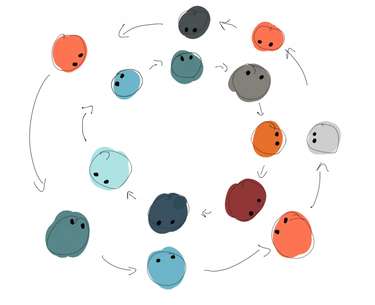

# Let's Connect

Focus: Let's get to know each other

Facilitator: Peter Kofler [@codecopkofler](https://x.com/codecopkofler)

---

## Mad Tea Party

 

  

    
  

  

    Let's build two circles:   
    - the inner circle looking outwards  
    - the outer circle looking inwards  
  

---

## Finish The Sentences

The inner circle starts introducing him/herself \
by finishing two sentences:

- My name is [...], I am a [role].
- I am here today because [...] \
  and I will contribute [...].
- Optional: one random/fun fact about you.

---

## I'll Start

- My name is *Peter*, I am the *Code Cop* \
  (Technical Coach).
- I am here today because *I love Coderetreats* \
  and I will *try to create a learning environment*.
- My favourite programming language is Lisp &#x1f92f;

---

## Two Circles Now

- Let's stand in two circles.
- Both introduce themselves.
- Ask questions if there is time.
- Outer circle rotates to the right on signal.

*Let's go*

---

## The Sentences

- My name is [...], I am a [role].
- I am here today because [...] \
  and I will contribute [...].
- Optional: one random/fun fact about you.
