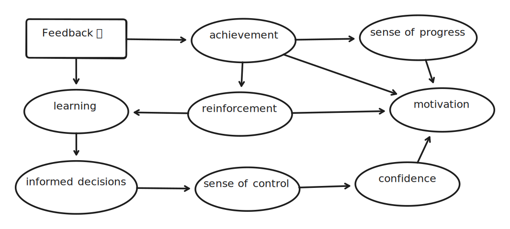

# Session 2

Focus: Incremental Software Development

Facilitator: Gregor Riegler [@gregorriegler](https://fosstodon.org/@gregorriegler@fosstodon.org)

---

## Feedback

- Why do we need it?

---

---

---

### We want Feedback early and often

- Small steps
- Many more much smaller steps 💯

---

## Qualities of such a step

- provides feedback
- functional
- passes the tests
- usable
- valuable
- small
- vertical over horizontal

---

---

## Ensemble

- Form 6 new groups.
- Start from scratch.
- Make the smallest steps possible applying the quality criteria

---

## Retrospective 🏟️
<!-- 10 minutes -->

Which increments did you come up with?

