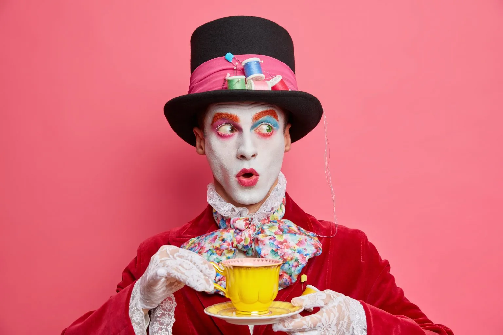

# Lunch

*Enjoy Your Lunch in the Kitchen!*

🥗🌽🥬🥟🍛🧆

**We will continue at 13:00!**

---

## Mad Tea Party

---

## Alice in Wonderland

  <blockquote style="width: 80%; border: 2px solid black; padding: 10px;">
    
<strong>The Mad Hatter :</strong> <em>"Have I gone mad?"</em>

    
<strong>Alice :</strong> <em>"I'm afraid so. You're entirely bonkers. But I'll tell you a secret. All the best people are."</em>

  </blockquote>

---

## The Setup

  

    
  

  

    Let's build two circles:   
    - the inner circle looking outwards  
    - the outer circle looking inwards  
  

---

## Finish The Sentence

<blockquote style="width: 100%; border: 2px solid black; padding: 10px;">
  
<em>An insight or technique I discovered that  
  was particularly useful is … because …</em>

</blockquote>

---

## Rotate

Everybody takes one step to the right!

---

## Finish The Sentence

<blockquote style="width: 100%; border: 2px solid black; padding: 10px;">
  
<em>One question that’s still buzzing around  
  my brain after the morning sessions is …</em>

</blockquote>

---

## Rotate

Everybody takes another step to the right!

---

## Finish The Sentence

<blockquote style="width: 100%; border: 2px solid black; padding: 10px;">
    
<em>The funniest or weirdest thing in my sessions today was …</em>

</blockquote>

---

## Thank's 💗
