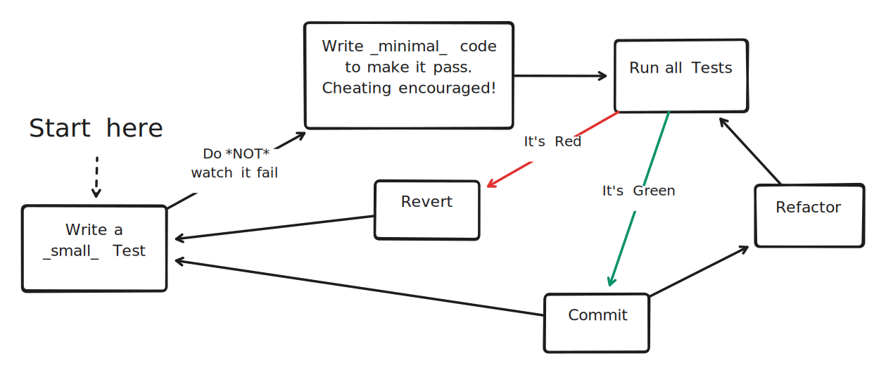

# Session 4

Focus: TCR (Test && Commit || Revert)

Facilitator: Gregor Riegler [@gregorriegler](https://fosstodon.org/@gregorriegler@fosstodon.org)

---

---

### TCR (Test && Commit || Revert)

---

## Demo

---

## Find a Partner! 👀

**No TCR Tooling!** (Too much setup time)

*"Pair programming is a conversation between people, where the byproduct is code."*

---

## Retrospective 🏟️
<!-- 10 minutes -->

How did the revert make you feel?
When did the revert feel like a good thing, and why?

---

## Enjoy the Coffee Break ☕

*And be back in 10 minutes.*
