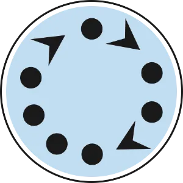

# Closing Circle

Focus: Let's get to know each other

Facilitator: Roland Germ [@codecopkofler](https://x.com/codecopkofler)

<!-- Closing Retro 17:00 17:30 -->

---

## 1-2-4-All ☀️
 

  

    
  

  

    <ul>
        <li>What, if anything, did you learn today?</li>
        <li>What, if anything, surprised you today?</li>
    </ul>
  

---

## Alone - 1 minute 🕑
  

  

    
  

  

    Answer the questions for yourself
  

---

## Find a pair - 2 minutes 🕑
  

  

    
  

  

    Share your answers, findings and discuss them
  

---

## Groups of 4 - 4 minutes 🕑
  

  

    
  

  

    <ul>
        <li>Just refine your results.</li>
        <li>Pay attention to similarities and differences.</li>
        <li>Agree on the most important aspects.</li>
    </ul>
  

---

## All ☀️
  

  

      
  

  

    <ul>
        <li>Which answers / results / findings did your group of four find particularly remarkable?</li>
        <li>What else is noteable for the whole group?</li>
    </ul>
  

